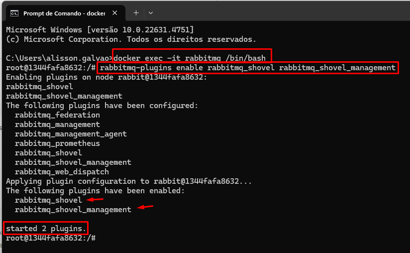

# Microserviço Proposta - PJ_springBoot_RabbitMQ
Projeto de microserviços com Spring Boot RabbitMQ e AWS

### Dependências Spring
- Spring Data JPA   //SQL
- Spring Web //WEB
- PostgreeSQL Driver //SQL
- Lombok //Developer Tools
- WebSocket //Messaging
- Spring for RabbitMQ //Messaging

### Imagens docker

#### FrontEnd

``docker run -d -p 80:80 --name proposta-web-container matheuspieropan/proposta-web``

#### PostgreSQL (docker-compose)

#### Definindo env:

```yaml
services:
  ## PostgreSQL
  postgreSQL:
    image: postgres
    restart: always
    environment:
      POSTGRES_DB: "propostadb"
      POSTGRES_USER: "postgres"
      POSTGRES_PASSWORD: "123"
    ports:
      # <Port exposed> : <MySQL Port running inside container>
      - "15432:5432"
    volumes:
      - ./data/postgres:/var/lib/postgresql/data
    networks:
      - postgres-network
  ## PGAdmin 4
  pgadmin:
    image: dpage/pgadmin4
    environment:
      PGADMIN_DEFAULT_EMAIL: "alissoncavalcanticma@gmail.com"
      PGADMIN_DEFAULT_PASSWORD: "321"
    ports:
      # <Port exposed> : <MySQL Port running inside container>
      - "8081:80"
    depends_on:
      - postgreSQL
    networks:
      - postgres-network
## Network
networks:
  postgres-network:
    driver: bridge
```
#### Levantando env com docker compose:

``docker-compose -f postgreSQL_env.yml -p postgresql_env up -d``

*PGAdmin via browser apresenta problemas e conexão, opção de client windows foi utilizada*

```yaml

version: "3.2"
services:
  rabbitmq:
    container_name: 'rabbitmq'
    image: rabbitmq:3-management
    environment:
      RABBITMQ_DEFAULT_USER: user
      RABBITMQ_DEFAULT_PASS: 123
    ports:
      - 5672:5672
      - 15672:15672
    volumes:
      - ~/.docker-conf/rabbitmq/data/:/var/lib/rabbitmq/
      - ~/.docker-conf/rabbitmq/log/:/var/log/rabbitmq
    networks:
      - rabbitmq_net

networks:
  rabbitmq_net:
    driver: bridge

```
#### Levantando env com docker compose:

``docker-compose -f rabbitMQ_env.yml -p rabbit_mq_env up -d``

#### Como adicionar plugin para  mover mensagens das filas RabbitMQ:

### Acessando Container Rabbit MQ:
``docker exec -it rabbitmq /bin/bash``

### Executando o comando de instalar plugin:
```rabbitmq-plugins enable rabbitmq_shovel rabbitmq_shovel_management```


